<h1 align="center">
    
</h1>

#### ignite-react-chapter02

## Chapter II 

## Trilha ReactJS 

## Primeira Aplicação Web com ReactJS

## 1 Estrutura da aplicação

### 1.1 Introdução do módulo

### 1.2 Estrutura com create-react-app

Vamos cria um template que ira monta toda a base de uma aplicação:
`yarn create react-app ignite-react-chapter02 --template typescript`

Agora vamos limpar o projeto:
Vamos inicia pelo arquivo: public/index.html

Vamos retira:
`<link rel="icon" href="%PUBLIC_URL%/favicon.ico" />`

E vou retira tudo ate o title

<h1 align="center">
    
</h1>

Vamos trocar o titulo de `<title>React App</title>` para `<title>Controle Contábil</title>`:

Vamos deletar toda parte comentada a baixo e ficara assim:

<h1 align="center">
    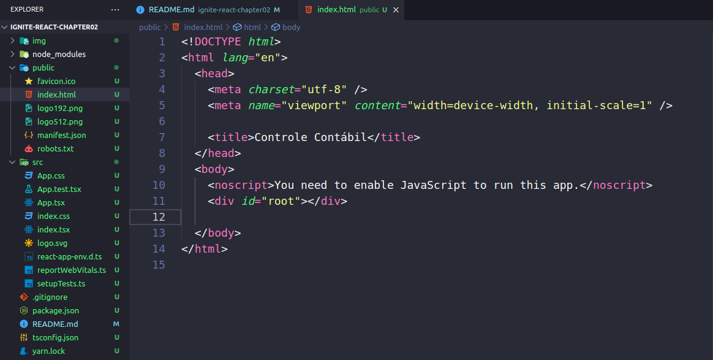
</h1>

E vamos deletar todos os arquivos da pasta `public` menos o arquivo `index.html`.

<h1 align="center">
    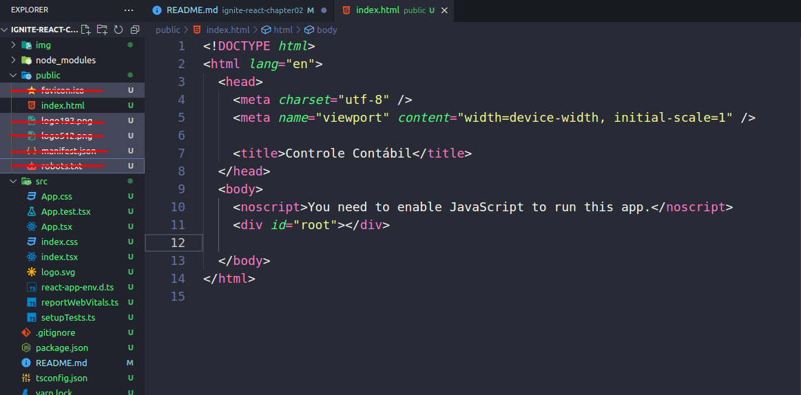
</h1>

E dentro da pasta `src` vamos delatar os arquivos:

<h1 align="center">
    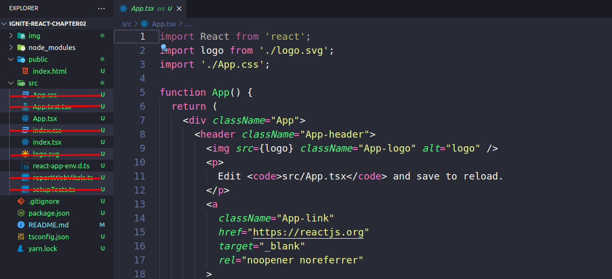
</h1>

Ficando so o arquivos: `App.tsx`, `index.tsx` e `react-app-env.d.ts`.

No `index.tsx` vamos remover a importação do css `import './index.css';`.
A importação do `import reportWebVitals from './reportWebVitals';`.
E toda parte comentada.

No `App.tsx` vamos remover a importação do `import React from 'react';`.
A importação do `import logo from './logo.svg';`.
A importação do `import './App.css';`.

Retira todo o `header`. e deixa so a div.

E vamos colocar um `<h1>Hello World</h1>`

E vamos tambem expostar o App `export function App() {}`

Assim que importa a `App` so vai poder importa com nome `App`. Isso vai ajudar a debugar o codigo.

Agora dentro do aquivo `package.json` vamos criar uma `"devDependencies"` recortando os codigos e colocando nele.

<h1 align="center">
    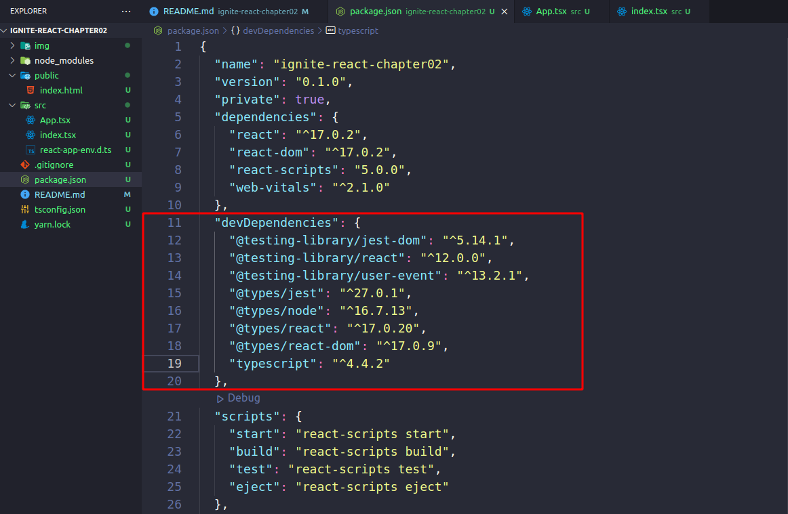
</h1>

### 1.3 Exportando assets do Figma

Link para acessa figma:
https://www.figma.com/file/0xmu9mj2TJYoIOubBFWsk5/dtmoney-Ignite-(Copy)?node-id=0%3A1

Caso não consiga baixar pelo figma segui o link das logos.
E link Assets:
https://xesque.rocketseat.dev/platform/1615808314498-attachment.zip

Vamos exportar as `layers` que significa camadas: 
1 - Logo.

<h1 align="center">
    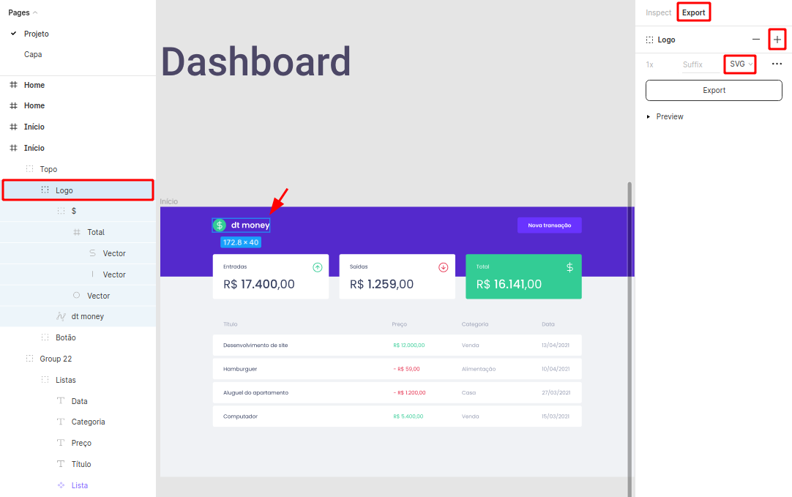
</h1>

Vamos criar uma pasta dentro `src` com o nome de `assets` e colocar logos.
Esse vamos reomea para `logo.svg`.

2 - Vamos exposta so a bolinha:
no formado png
E vou chamar de `favicon.png`
Na pasta index.html

<h1 align="center">
    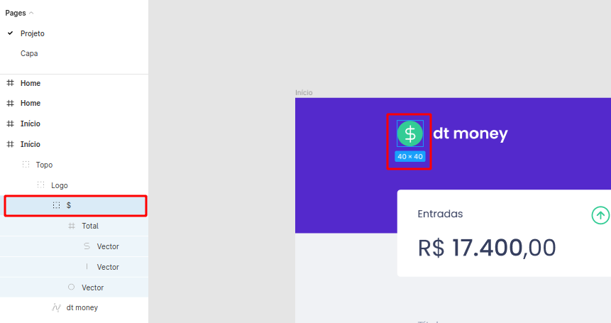
</h1>

3 - Agora os vetores
no formado svg

<h1 align="center">
    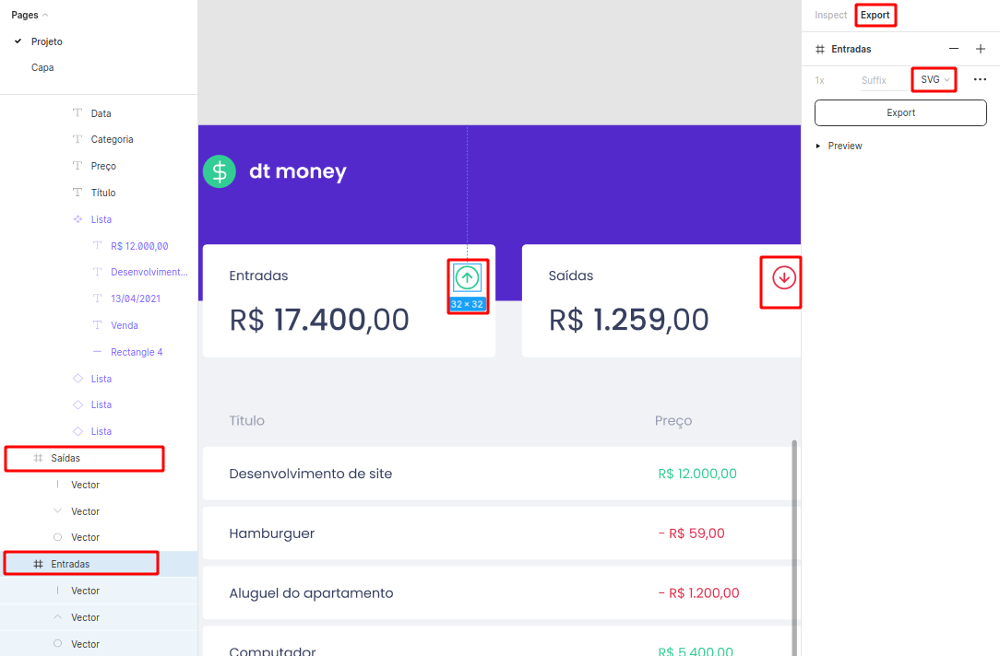
</h1>

4 - O vetor de fecha

E ficando assim os vetores renomeados:

<h1 align="center">
    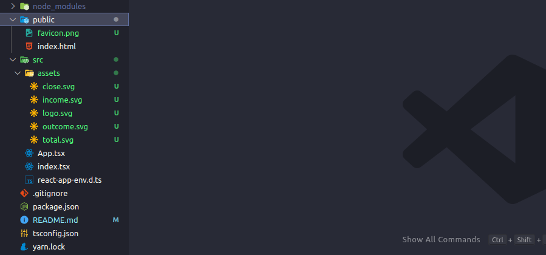
</h1>

E vamos anotar as cores do figma para passar no scc:

### 1.4 Instalando Styled Components

Vamos inicia instalando uma das bibliotecas que e Styled Components

`yarn add styled-components`

Vamos no arquivo `App.tsx` entender nossa estilização.

Vamos entender com esse Exemplo:
E vamos cria um `App.css` e vamos estilizar uma propriedade `.title`

<h1 align="center">
    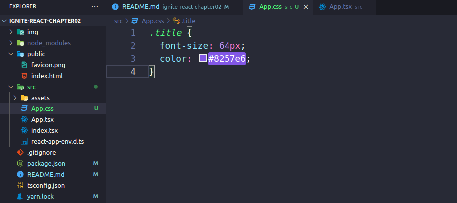
</h1>

E vamos em `App.tsx` importamos o `App.css`.
e vamos colocar um `className` dentro do `h1` assim `<h1 className="title">Hello World</h1>`.

<h1 align="center">
    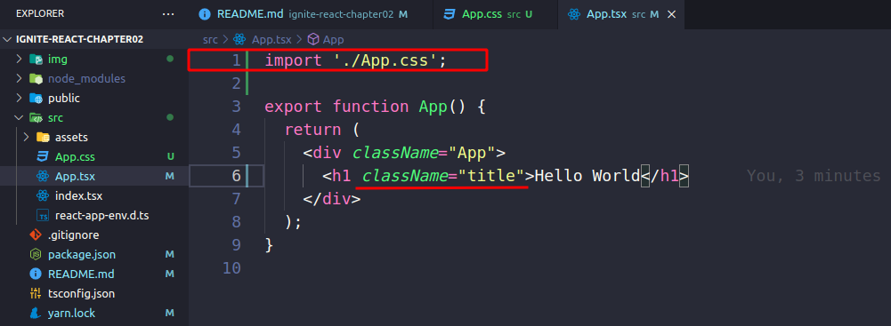
</h1>

E vamos rodar a aplicação com:
`yarn start`

localhost:3000
<h1 align="center">
    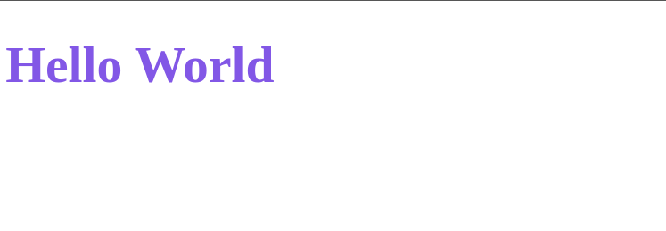
</h1>

Agora vamos fazer diferente:
Vamos apaga o arquivo `App.css` e dentro do arquivo `App.tsx` vamos importa:
`import styled from 'styled-components';` e ele ira apresenta um erro:

<h1 align="center">
    
</h1>

E sempre que aparecer esse tipo de error que sugere instala um pacote adicional, nos instalamos como dependencia de desenvolvimento.
`yarn add @types/styled-components -D`

E para estiliza o mesmo titulo usando Styled Components.
Vamos criar um componente estilizado, como uma costante variavel chamada por exemplo `Title` ficando assim:

`const Title = styled.h1`` `
Instala a extenção do VC.Code `vscode-styled-components`.

E ao em vez de colocar `h1` vamos colocar um componete `title`

<h1 align="center">
    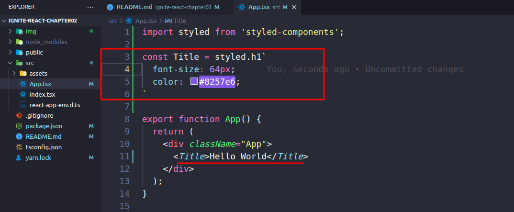
</h1>

Tendo a vantagem do css ficar proximo e não atralha os outros css de componetes.

### 1.5 Criando estilos globais

Como usar Styled Components, para criar umas estilizações globais para a aplicação.
Vamos começa remomvendo tudo que tem do Styled Components dentro do `App.tsx`.

```
import styled from 'styled-components';

const Title = styled.h1`
  font-size: 64px;
  color: #8257e6;
`
```
Vamos deixa so o h1 com Hello World `<h1>Hello World</h1>` dentro da div.

E dentro da pasta `public` no arquivo `index.html` colocar nosso favicon.

<h1 align="center">
    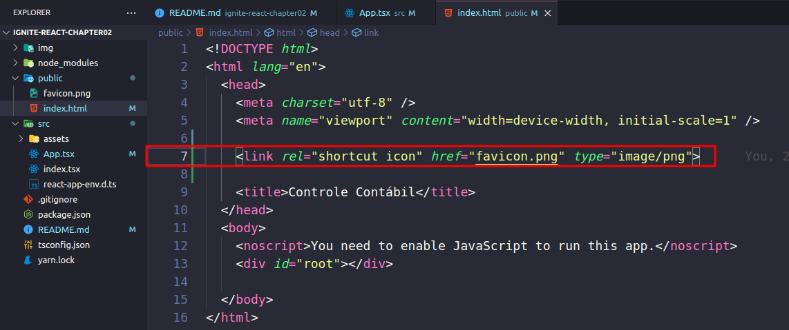
</h1>

E vamos rodar a aplicação com:
`yarn start`

Agora para fazer os estilos globais vamos na pasta `src` vamos criar uma pasta `styles` e dentro dela um arquivo `global.ts`.
Vamos criar um a importação: `import { createGlobalStyle } from 'styled-components';`
E criar uma variavel: `export const GlobalStyle = createGlobalStyle`` ` com spas no final para colocamos os codigo css.

Seve para deixa a fonte com mais qualidade nos Browser `-webkit-font-smoothing: antialiased;`.

<h1 align="center">
    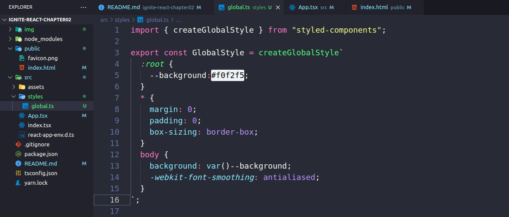
</h1>

Agora vamos importa o arquivo para ver como ele esta:

No arquivo `App.tsx` que e o arquivo principal da aplicação vamos colocar o `<GlobalStyle/>` em qualque lugar e depois arrumamos.

E vamos continual no arquivo `global.ts`.
E configura o tamanho de fonte da aplicação. E por pagrão o font-size: 16px e um padrão e fuciona muito bem para Desktop.

Eu vou falar quando meu usuario estive com uma tela ate 1080px de largura, eu vou diminuir o font-size eu vou deixa ele em 93.75%.
Isso para quando a aplicação for usada em dispositivos menores.

<h1 align="center">
    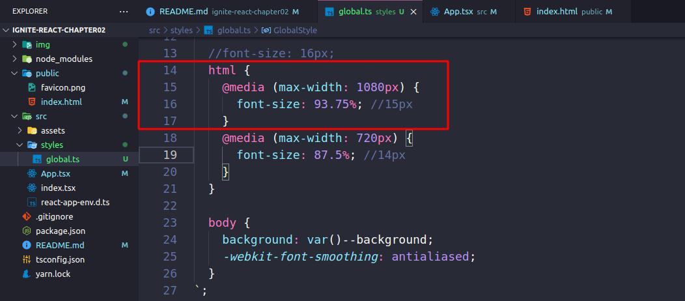
</h1>

Vamos continuar estilzando.
Um `cursor: pointer;` dentro de button
e vamos dizer a ele: Que tudo que estiver desabilitado em nossa aplicação [disabled] vamos colar um `opacity:0.6;` que ira deixa ele bem mais clarinho e vamos colocar um `cursor: not-allowed;` que e plaquinha de não permitido.

<h1 align="center">
    
</h1>

Agora vamos colocar as variavel de cor dentro do `root`

<h1 align="center">
    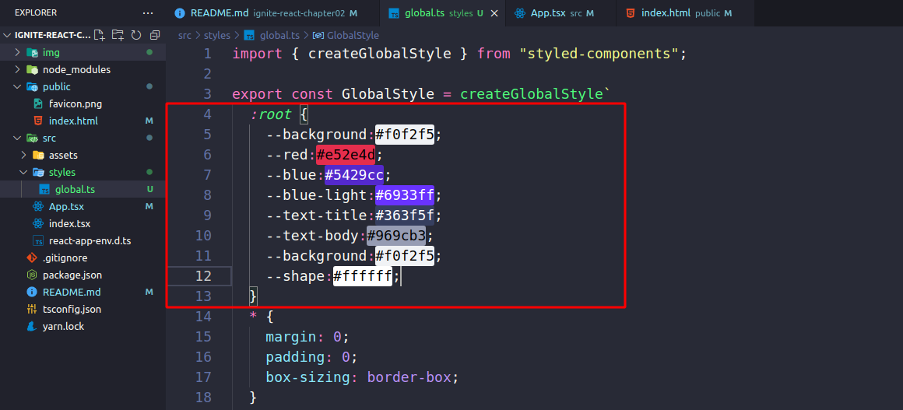
</h1>

### 1.6 Fontes do Google Fonts

Vamos configura uma fonte diferente na aplicação.
E maioria das fontes que os Web design vão ultizar esta disponiveis site do google font:

https://fonts.google.com/
Mais vamos em:
https://fonts.google.com/specimen/Poppins

E vamos selecionar os tamanho que vamos usa na aplicação:
400 regular
600 semi-bold

via link:

E vamos colocar dentro do `index.html`, deixando o `preconnect` em cima, ficando assim:

<h1 align="center">
    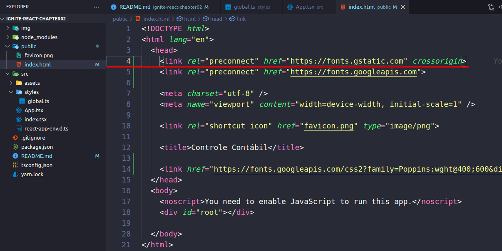
</h1>

Agora no arquivo global do css, vamos defenir a fonte poppins, no corpo da aplicação, no imput, no textarea e no button:

```
body, input, textarea, button {
    font-family: 'Poppins', sans-serif;
    font-weight: 400;
  }
  h1, h2, h3, h4, h5, h6, strong {
    font-weight: 600;
  } 
```

<h1 align="center">
    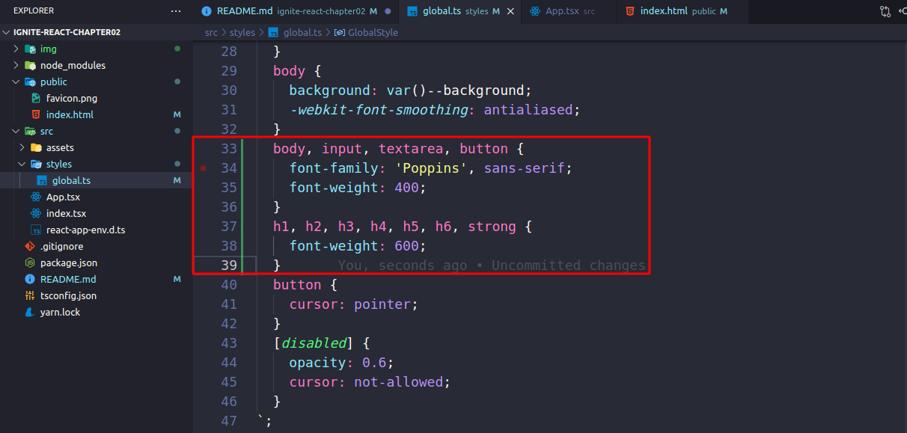
</h1>

## 2 Componentização.

### 2.1 Componente: Header

Começa a vcriando o primeiro componete visial, iniciando com uma pasta chamada `components` e dentro uma pasta chamada `Header` e dentro um arquivo `index.tsx`.

Vamos inicia para intendimento um função chamada Header `function Header(){}`
Que retorna por exemplo um html. Como `<header>` e dentro o cabeçalho da aplicação.
E vamos exportar tambem essa função dentro com `export`, ficando assim:

<h1 align="center">
    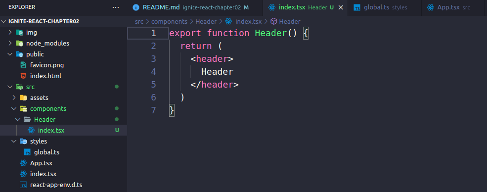
</h1>

Agora vamos para o arquivo `App.tsx` e vamos adicionar no lugar de `h1` o nosso componete `<Header />`.
E no lugar da `div` vamos ultilizar uma Fragment `<> ... </>`

<h1 align="center">
    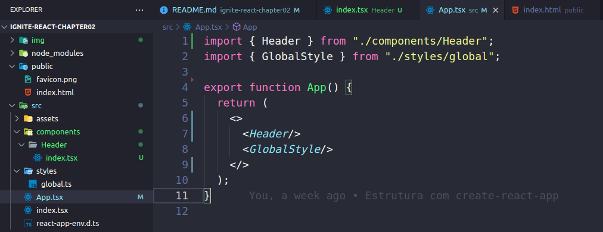
</h1>

E vamos rodar a aplicação com:
`yarn start`

Agora vamos começa a estilização desse Header:
Vamos inicia criando a estrutura antes do css.
Vamos inicia colocando a logo, e dentro do `<header>` colocamos um: 
``.
Onde vamos preencher da seguinte forma. O texto alternativo como `dt money`:
``.
E vamos criar um `button` com o nome Nova Transação.
`<button type="button">Nova Transação</button>`.

E agora vamos importa o arquivo que e a `logo.svg`
`import logoImg from '../../assets/logo.svg'`.

E dentro do `<header>` em img e src={} vamos colocar chaves para incluir uma variavel javascript.

<h1 align="center">
    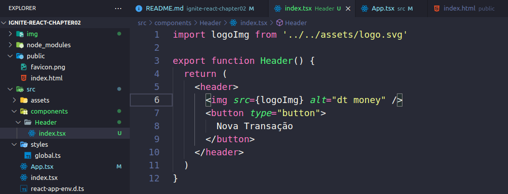
</h1>

Agora vamos colocar o css, e na pasta chamada `components` e dentro uma pasta chamada `Header` vamos criar um arquivo chamado `styles.ts`, e dentro ira todas as estilizações relacionadas com header.
Começa importando:
`import styled from 'styled-components';`


Agora vamos criar o nosso primeiro componete estilizado que vai se chamar `Container` e ele vai ser uma tag do type `header` e dentro dela as estilizações.

`export const Container = styled.header``; `

Vamos colocar `background: var(--blue);`

```
export const Container = styled.header`
  background: var(--blue);
`;
```
<h1 align="center">
    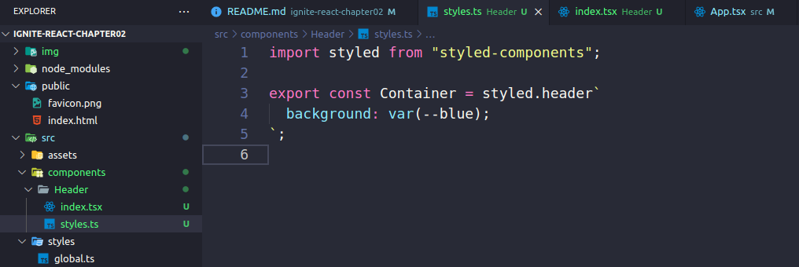
</h1>

Vamos salva e voltamos no header e no lugar de `<header>` vamos colocar `<Container>`

<h1 align="center">
    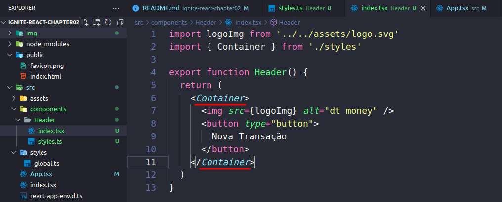
</h1>

Agora a nossa primeira estilização ja esta visilvel no Browser.

<h1 align="center">
    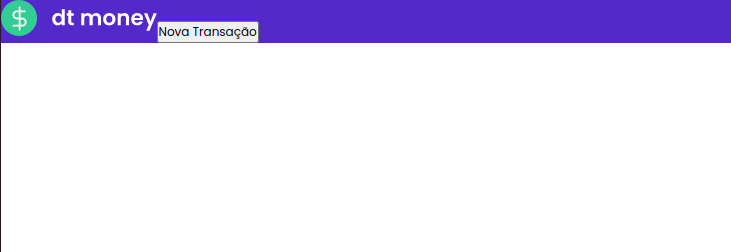
</h1>

E vamos adiciona mais um Container a esse header.

E vamos na estilização e exportamos Content e podemos ultiliza uma `div`.
`export const Content = styled.div``; `.

<h1 align="center">
    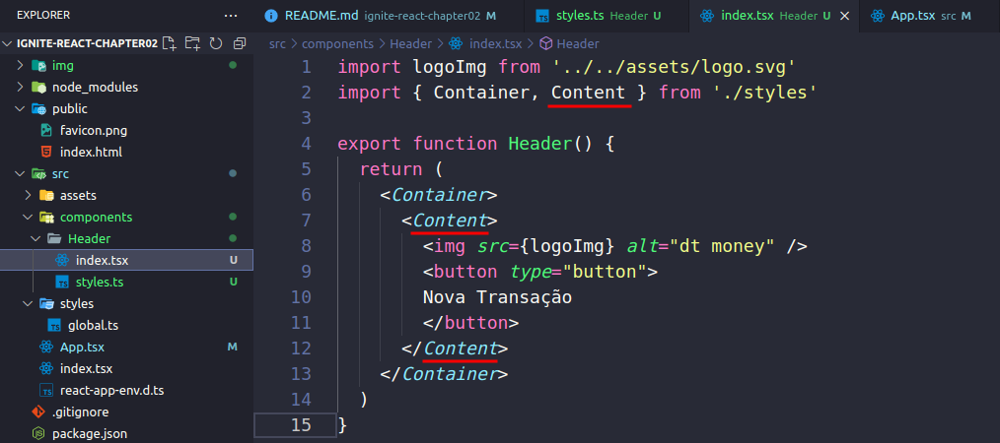
</h1>

E vamos colocar `max-width` para ter uma lagura maxima.

E vai está sempre centralizado com `margin: 0 auto;`.

Vamos adiciona `padding: 2rem 1rem 12rem;` onde 1rem sempre vai pegar o tamanha do font-size.

Vamos colocar um `display: flex;`.

Vamos colocar um `align-items: center;` para deixar nossa logo e o botão alinhados.

Vamos colocar um `justify-content: space-between;` para que haja um espaço entre a logo e o botão.

Agora vamos colocar uma estilização para o botão `button {}`;

E dentro dele um `font-size: 1rem;`.

Vamos dar um `color: #fff;`.

Vamos dar um `background: var(--blue-light);`.

Vamos dar um `border: 0;` para remover a borda que ja vem nele.

Vamos dar um `padding: 0 2rem;` Espaçamento tanto de um lado quanto do outro.

Vamos dar um `border-radius: 0.25rem;` que vai equivale a 4px no desktop.

Vamos dar um `height: 3rem;`.

Vamos dar uma transição `transition: filter 0.2s;`

Vamos colocar um filtro dentro do `&:hover{}`.

Como `filter: brightness(0.9);` que vai escurecer o botão levemente.

<h1 align="center">
    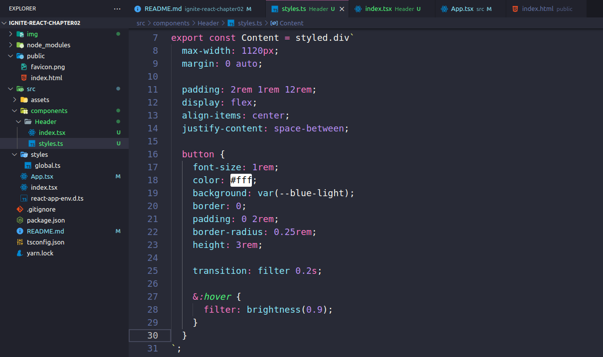
</h1>

### 2.2 Componente: Summary

Vamos criar um componete chamado Dashboard:
Iniciamos criando uma pasta dentro de `components` com o nome `Dashboard` e dentro um arquivo com o nome: `index.tsx` e um `styles.ts`.

Dentro de `index.tsx` vamos expostar a `function`.
Que ira funcionar como uma pagina da aplicação, que tera um resulmo das entradas e saida.

<h1 align="center">
    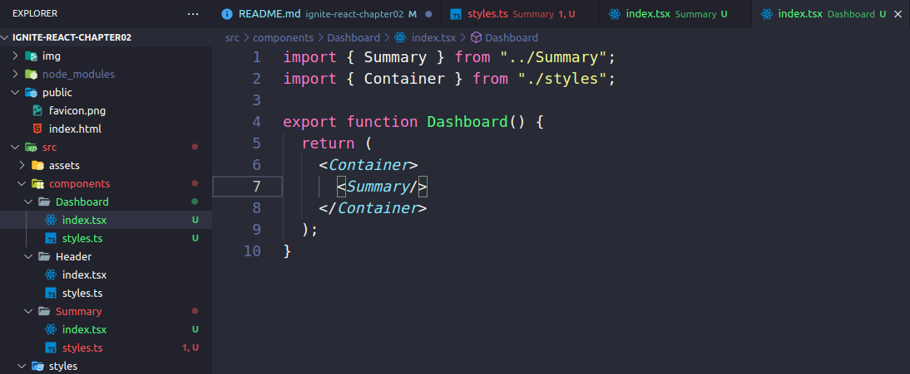
</h1>

No `styles.ts` vamos estilizar.

<h1 align="center">
    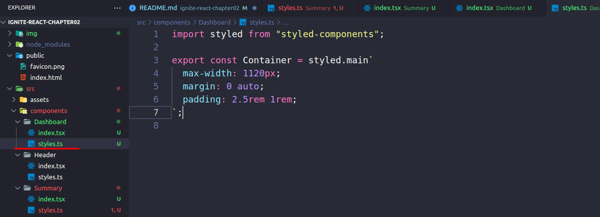
</h1>

E vamos criar mais uma pasta com nome `Summary` e um arquivo chamado `index.tsx`.

<h1 align="center">
    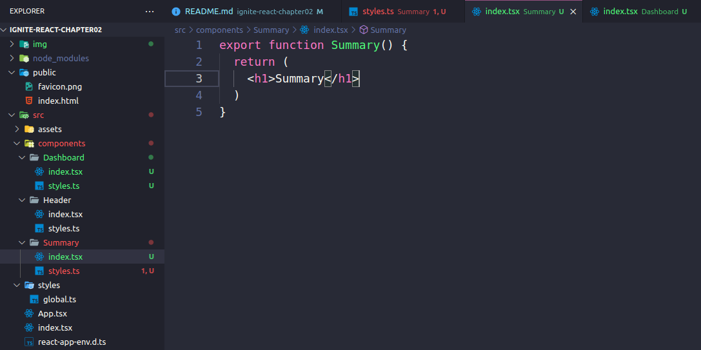
</h1>

E no arquivo `styles.ts` mais adicionar as seguintes linhas:

<h1 align="center">
    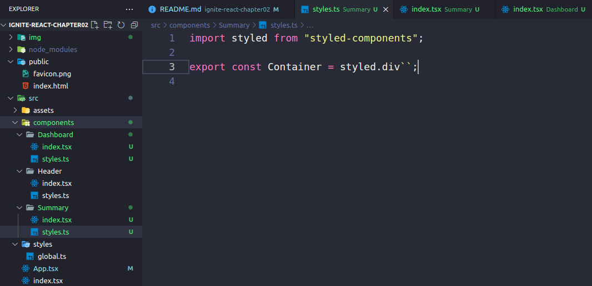
</h1>

E agora no `App.tsx`, vamos colocar em baixo do `<Header/>` o `<Dashboard/>`

<h1 align="center">
    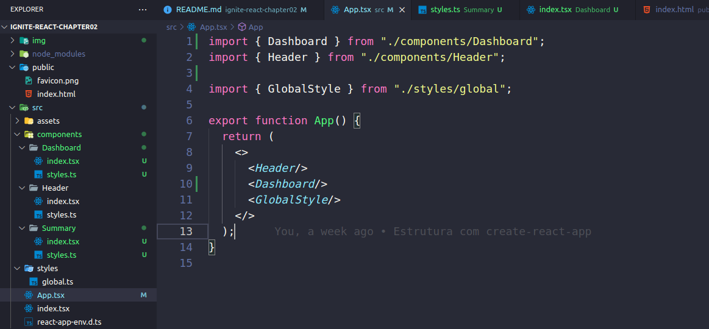
</h1>

E vamos rodar a aplicação com:
`yarn start`

Agora vamos começa criar a estrutura html das caixa de informações.
src/components/Summary/index.tsx

Vamos criar um Container no lugar do `<h1>Summary</h1>` 

<h1 align="center">
    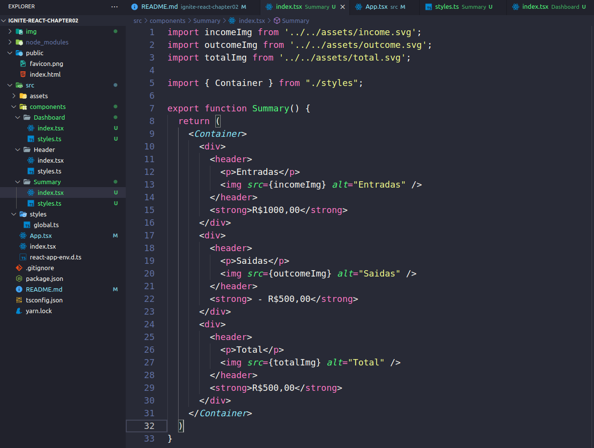
</h1>

E agora vamos dentro do Container das estilizações no `styles.ts`.

`display: grid;` Porque são tres itens do mesmo tamanho um do lado do outro.

`grid-template-columns: repeat(3, 1fr);` Tres 3 colunas com 1 tamanho flexível cada uma delas.

`gap: 2rem;` Que e o espaçamento entre cada um dos grid.

`margin-top: -10rem;` Jogar o Summary, mais pra cima.

Agora vamos para os itens, que foram colocados como `div {}`. 

`background: var(--shape);` Para ficar com fundo branco.

`color: var(--text-title);` Para mudar a cor do texto.

Vamos pegar o cabeçalho que esta dentro `header {}`

E nosso `strong {}` que e nosso texto

`display: block;` Porque por padrão o strong vem com o display inline ai o margin-top não funciona.

E vamos colocar uma classe na div total dentro do do `Summary` no arquivo `index.tsx`:
Ficando assim: `<div className='highlight-background'>`.

<h1 align="center">
    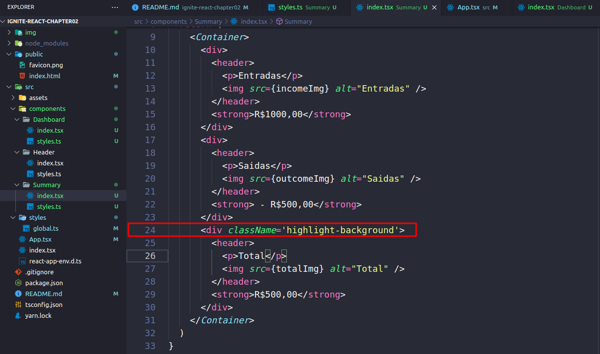
</h1>

E vamos no `styles.ts` e falo que a div, onde esta o `&.highlight-background{}`

```
&.highlight-background {
      background: var(--green);
      color: #fff;
    }
  }
```
<h1 align="center">
    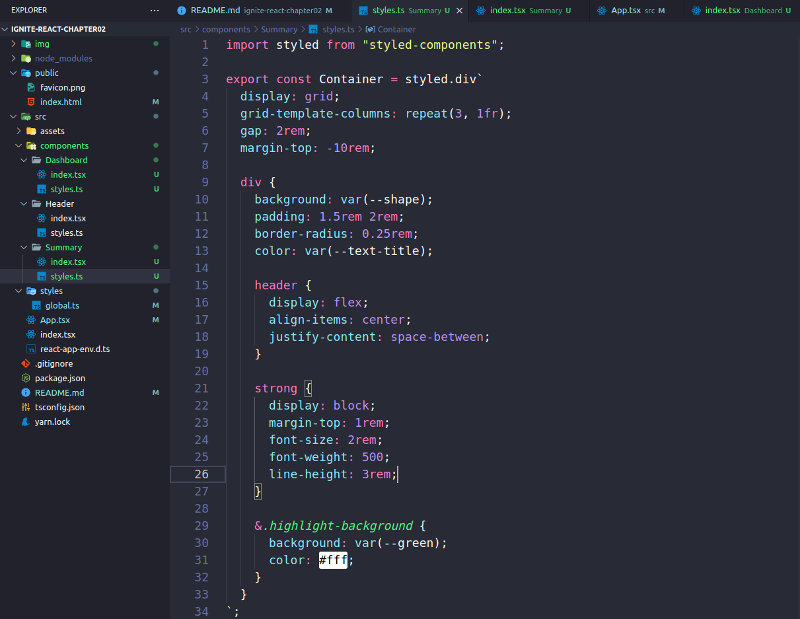
</h1>

Ficando assim:

<h1 align="center">
    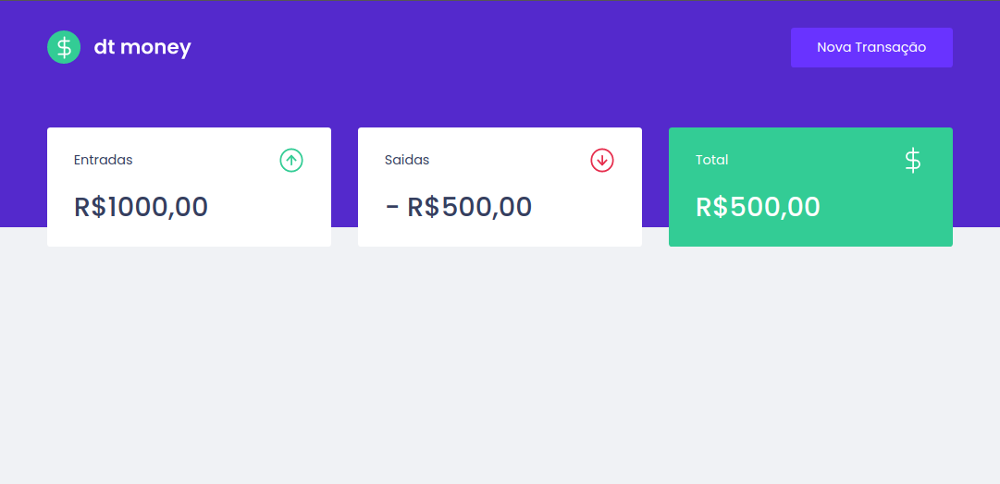
</h1>


### 2.3 Componente: TransactionsTable

Vamos cria dentro da pasta components uma outra pasta chamada de `TransactionsTable` e dentro um arquivo `index.tsx` e `styles.ts`.

<h1 align="center">
    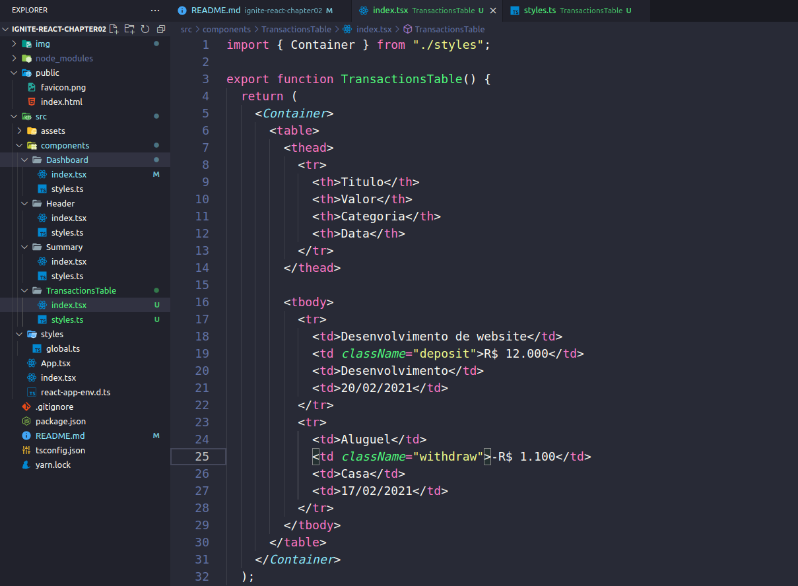
</h1>

Arquivo `styles.ts`.

`border-spacing: 0 0.5rem;` serve para despaçamento entre os intens.

`border-radius: 0.25rem;` serve para aredondamento de borda.

`&:first-child {};` Para a primeira parte fazer.

`&.deposit {}` Quando for um deposito fazer.

<h1 align="center">
    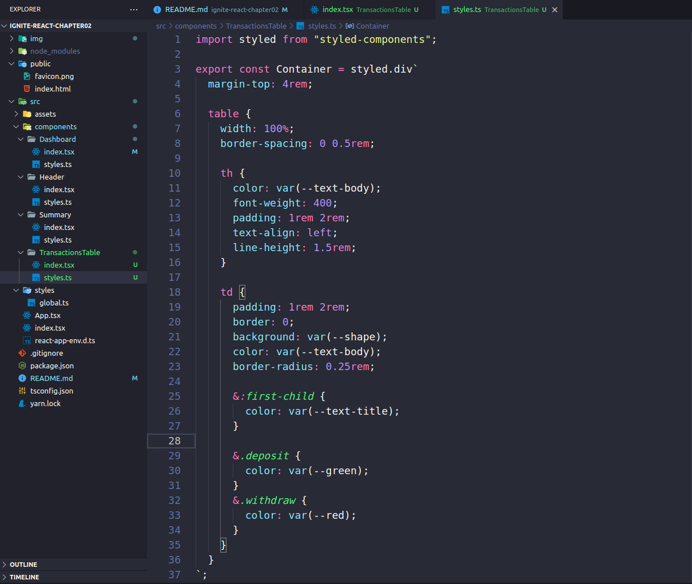
</h1>

Ficando assim:

<h1 align="center">
    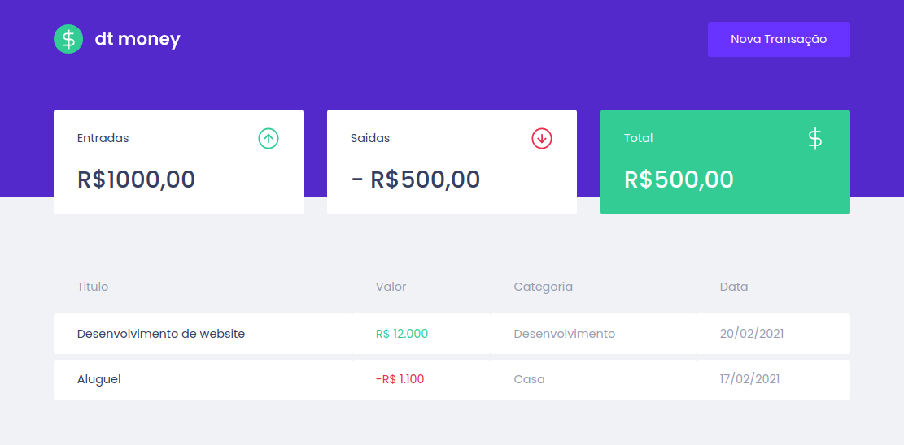
</h1>

## 3 Consumindo API.

### 3.1 Criando front-end sem back-end

JSON Server: Vai permiti que ao criarmos um arquivo `json` e com a estrutura de um objeto, cada chave desse objeto, ele vai converte em uma rota da nossa aplicação.
Entretanto ele não tem as funcionalidade de execulta junto com a aplicação.

MirageJS: Vamos nos ajudar a construir uma IPA fake, dentro do nosso Front-End.
Ele tem bancos de dados integrados, posibilitado relacionamento, consegue prencher com dados fictício.
https://miragejs.com/docs/getting-started/introduction/

### 3.2 Configurando MirageJS

Se eu quisesse carregar um transactions, eu teria um `useEffect(() => {}, [])` com um arrey de dependência e se ficar vazio ele ira executa apenas uma vez e toda variável que estive dentro ele vai executa de novo. Ai poderia também ser feito um `fetch('')` para nossa rota e dentro o nosso endereço da própria aplicação, ficando assim: `fetch('http://localhost:3000/api/transactions')` e apos isso vamos pegar a resposta dessa nossa requisição com um `.the(response => response.json( ))` convertendo a resposta para json.
E quando a resposta estiver convertida para json, vamos dar um console.log( ) nos dados para ver oque esta sendo retornado, assim: `.then(data => console.log(data))`

E se rodar a API e foir especionar em console tera um error:

<h1 align="center">
    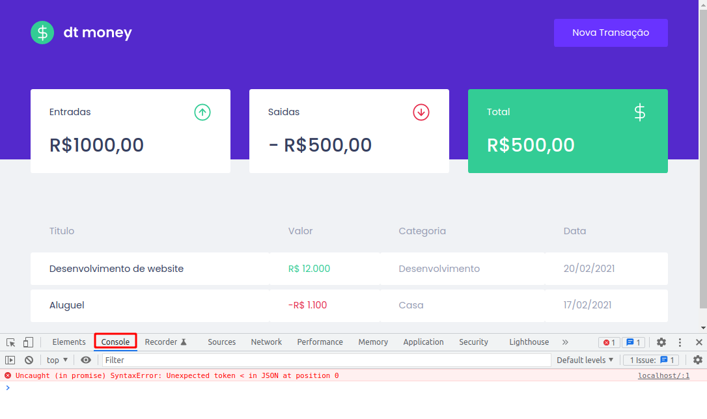
</h1>

E se formos em Network e der um F5 e formos na requisição que ele fez a transactions e em Preview

<h1 align="center">
    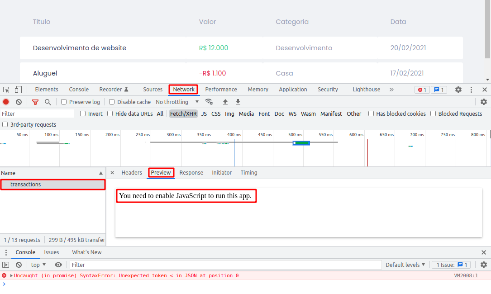
</h1>
You need to enable JavaScript to run this app.
Você precisa habilitar o JavaScript para executar este aplicativo

Ou seja eu não tenho nem um arrey de transição sendo retornado:

Vamos inicia instalando o MirageJS:
`yarn add miragejs`

E dentro do arquivo `index.tsx` que esta dentro da pasta `src`

`import { createServer } from 'miragejs'`

E dentro chamar a função createServer `creatServer({})` e definir `routes()` que se refere as rotas que teremos na API.
Com `this.namespace = 'api'` que todas as chamadas que eu fizer serão aparti desse endereço `api`.
E para cada uma das rotas eu digo: `this.get('/transactions', () => {})`.
Que quando houver uma requisição do tipo get, que e uma requisição de busca, para rota transactions, e vou retorna alguns dados ficticios.

<h1 align="center">
    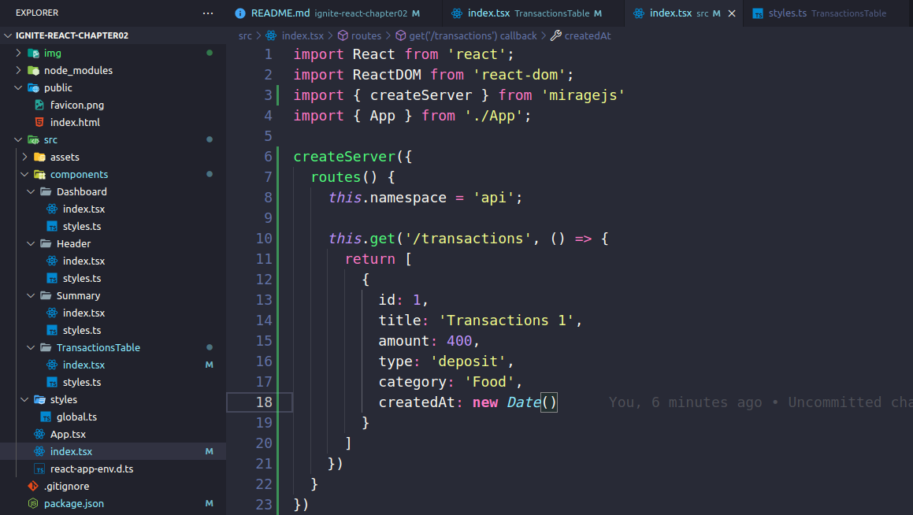
</h1>

### 3.3 Configurando cliente do Axios

Configura um cliente HTTP, para gente não precisa fazer as requisições utilizado o `fatch` que e a API nativa do http do proprio Browser epode ser utilizado no node.
Pois o problema do `fatch` e que precisa ficar transformando em json o nosso resultado todas as vez no final a operação.

Ja com Axios, ele pode intercepta requisições e resposta para nossa API.

Vamos inicia instalando o MirageJS:
`yarn add axios`

Vamos criar uma pasta dentro de src para colocar o Axios dentro.
Pasta chamada `services` que tem mais o intuito de ser serviços de dados, e dentro um arquivo `api.ts`.

Vamos começa importando o axios `import axios from 'axios';`
Criar uma constante chamada api `const api = axios.create({})` e dentro dele uma instacia, para seta algumas informações que vão ser padrão para todas as requisições que serão feitas.
E dentro do src/components/TransactionsTable/index.tsx vamos recorta o indereço `http://localhost:3000/api` para dentro `api.ts`

<h1 align="center">
    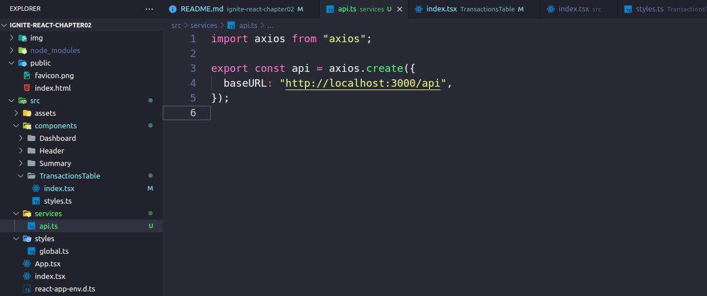
</h1>

E dentro do src/components/TransactionsTable/index.tsx
Vamos trocar o `fetch` por `api` 
Transforma o `data` em `response`

<h1 align="center">
    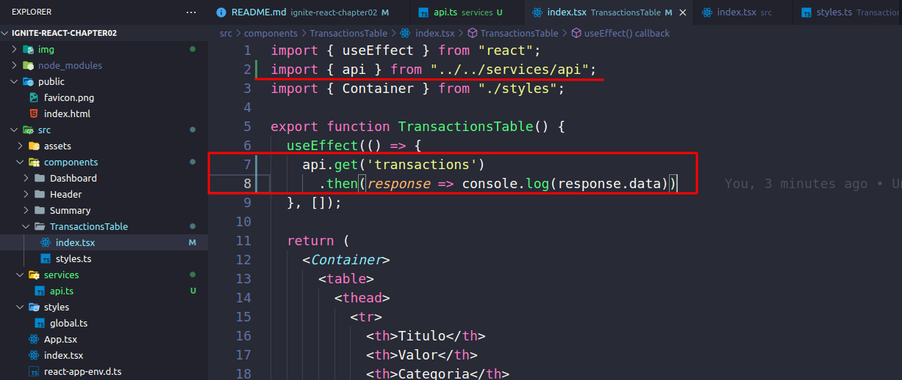
</h1>

## 4 Modal & Forms.

### 4.1 Configurando modal de criação

Configura o modal para cadastra uma nova transação usando uma biblioteca react-modal, pois ela ja tras algumas funcionalidades prontas, como por exemplo dar um esc e fechar o modal.

Vamos inicia instalando o react-modal:
`yarn add react-modal`

Vamos instalando o @types/react-modal como -D:
`yarn add @types/react-modal -D`

Documentação:
https://github.com/reactjs/react-modal

Inicia criando o modal dentro do Header, pois e onde esta o botao de Nova Transação.

Inicia criando um estado: `const [isNewTransactionModalOpen, setIsNewTransactionModalOpen] = useState(false);` apos isso pode se criar duas funções que sempre que essa função precisa de uma ação do usuario eu vou iniciar ela com `handle`.


<h1 align="center">
    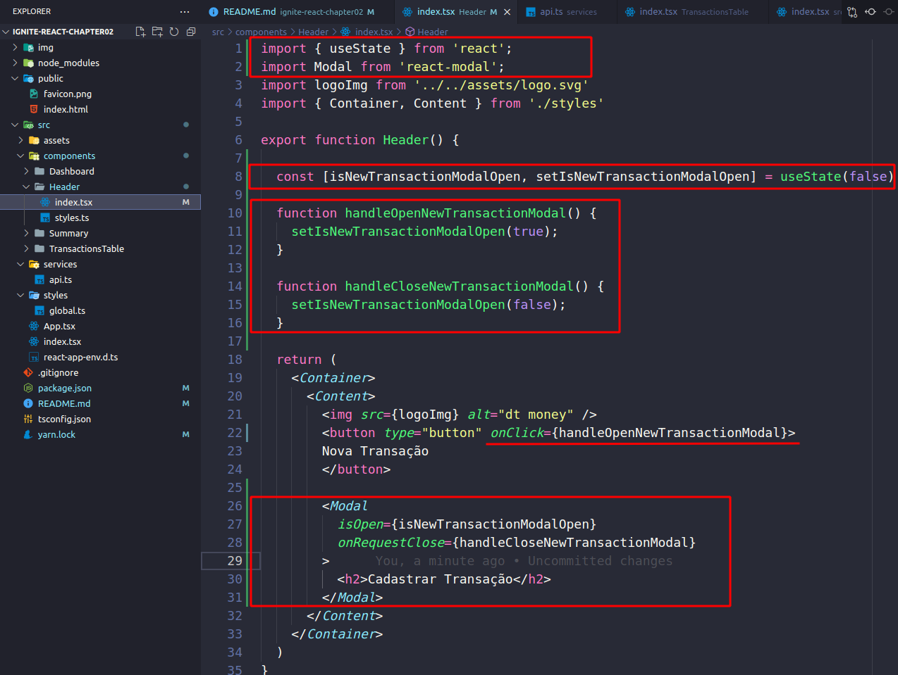
</h1>

Repasse de propriedade para os componetes.
E vamos migra todo o modal para dentro do `App.tsx`

E vamos pegar todos os estados e tambem mudar para dentro do `App.tsx`.

<h1 align="center">
    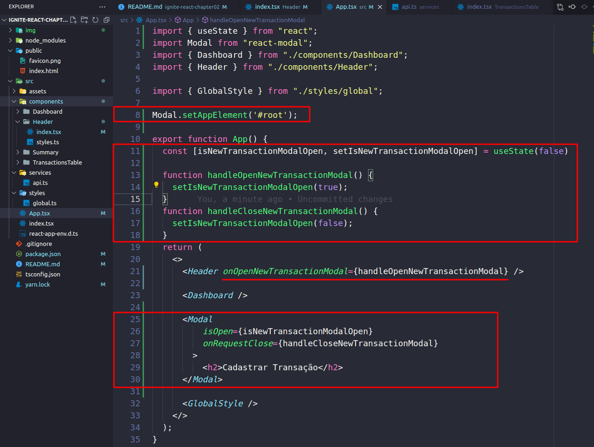
</h1>

E arrumar o Header.

<h1 align="center">
    
</h1>

### 4.2 Componente: NewTransactionModal

Vamos trabalhar no conteudo do modal
Para isso vamos criar um componete para o modal separado.
E dentro de src/components: vamos criar uma pasta `NewTransactionModal` e dentro um arquivo `index.tsx` e tambem o `styles.ts`.

E dentro `index.tsx` vamos inicia exportando uma função `export function NewTransactionModal() {}`, e dentro um ela ira retorna o conteudo que tem dentro do App.tsx.

Agora vamos definir uma interface que terão as propriedade que ela ira receber `interface NewTransactionModalProps {}`.

As propriedade: 

`isOpen: boolean;` que vai receber se o modal esta aberto ou não.

`onRequestClose: () => void;` que e uma função que não retorna nada.

A baixo vou pegar esses propriedades atraves de desestruturação;

`export function NewTransactionModal({isOpen, onRequestClose}: NewTransactionModalProps) {`

E vamos passa elas dentro das propriedades que esta dentro do modal:

<h1 align="center">
    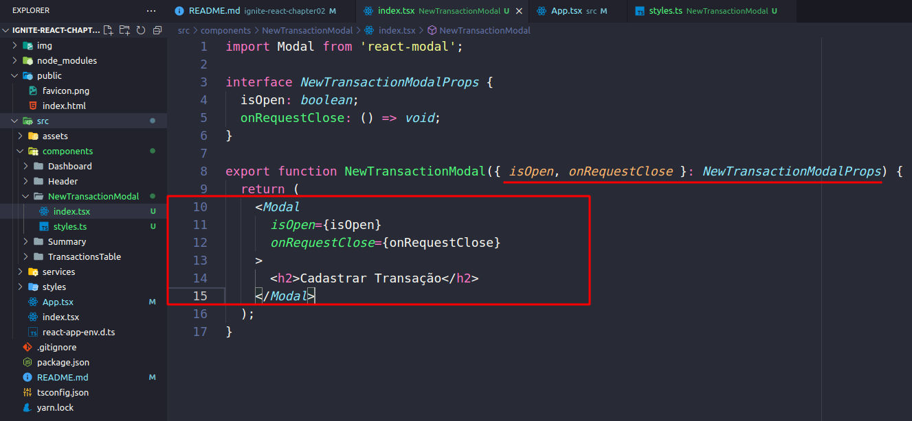
</h1>

E no `App.tsx` vou adicionar `<NewTransactionModal/>` e passar para ele as duas propriedades e o estado de cima.

`isOpen={isNewTransactionModalOpen}`

`onRequestClose={handleCloseNewTransactionModal}`

<h1 align="center">
    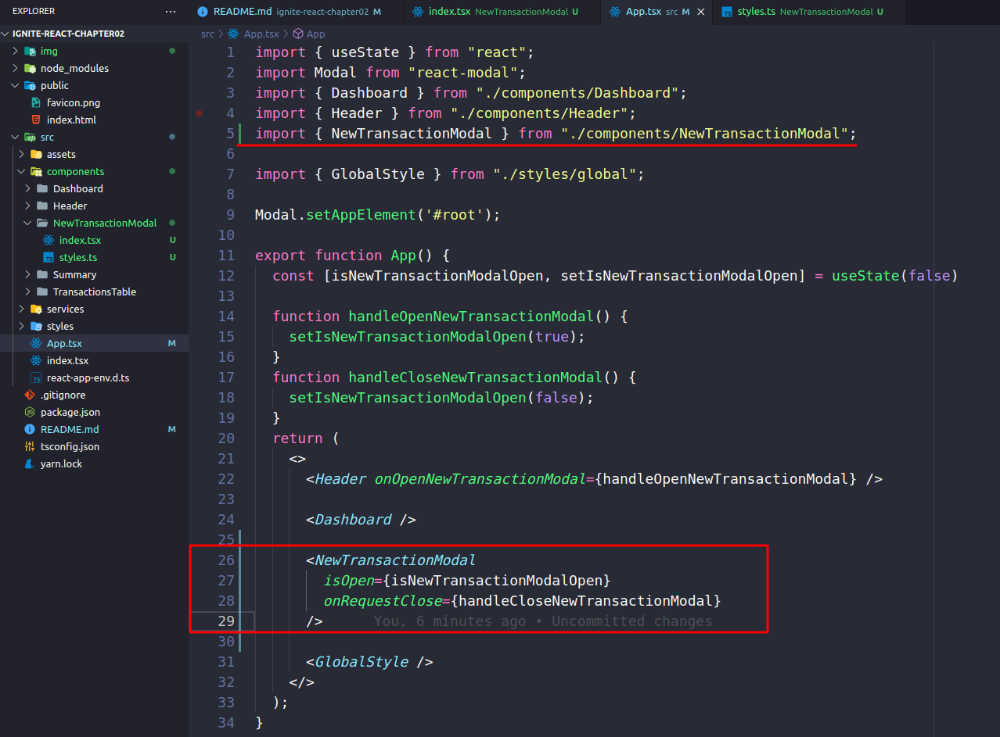
</h1>

E como o `styles.ts` não pode ficar vazio, mais so preencher assim:

<h1 align="center">
    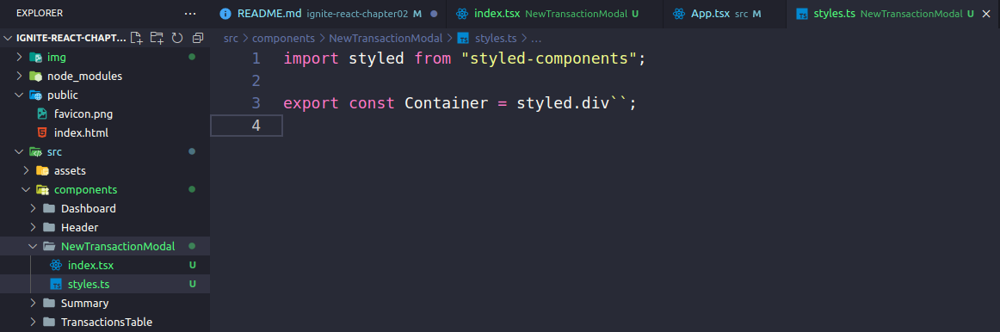
</h1>

E vamos rodar a aplicação com:
`yarn start`

### 4.3 Estrutura do formulário

Configura a estrutura do HTML do formulario

Começa criando os imputs:
Desntro da pasta `NewTransactionModal` no arquivo `index.tsx`. vamos criar um conteiner `<Container></Container>` formulario dentro da Modal por volta de tudo .

E transforma um <Container> em um formulario, dentro do arquivo altera `styled.div``;` para `styled.form``;`.

No arquivo `index.tsx`, em baixo `h2` vamos colocar os input `<input placeholder='Titulo'/>`

<h1 align="center">
    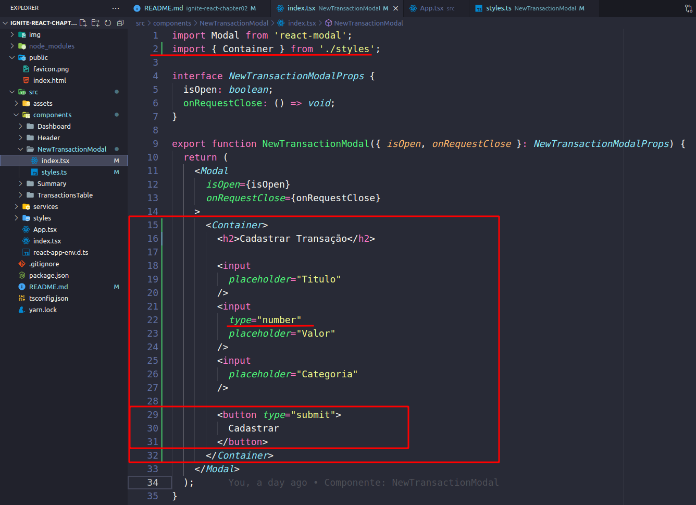
</h1>

E vamos rodar a aplicação com:
`yarn start`

E para estilizar o modal vamos passar dentro do Modal essas duas classes:
`overlayClassName="react-modal-overlay"`.
`className="react-modal-content"`.

<h1 align="center">
    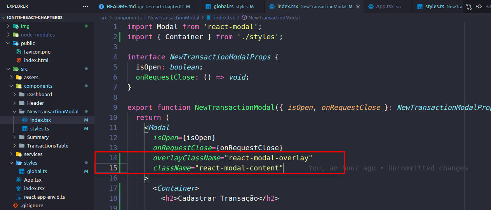
</h1>

E vou fazer uma estilização global em `global.ts`.

Vou adicinar as duas classe e adiciona `css` em ambos:

`.react-modal-overlay {}`

`position: fixed;` ele sempre vai ficar em cima da tela.

`.react-modal-content {}`

<h1 align="center">
    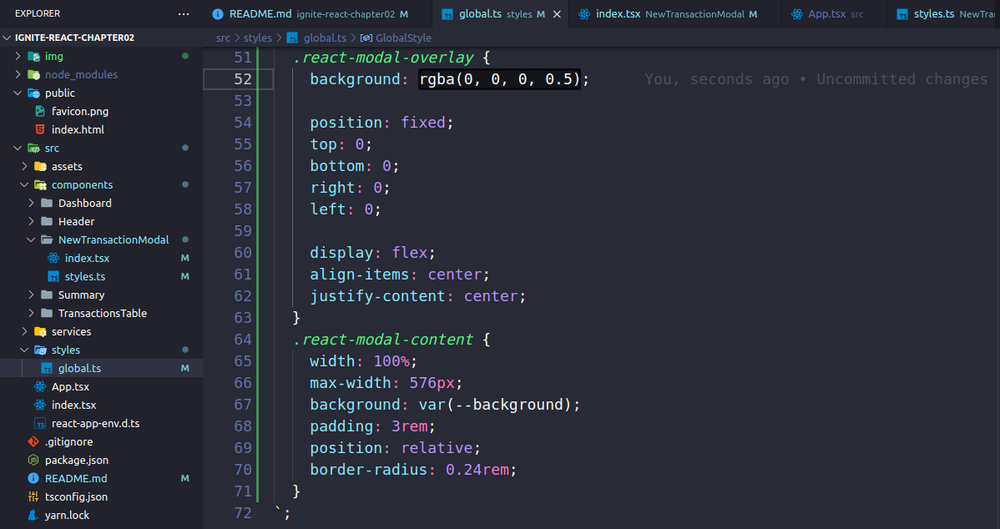
</h1>

Fica assim a estilização:

<h1 align="center">
    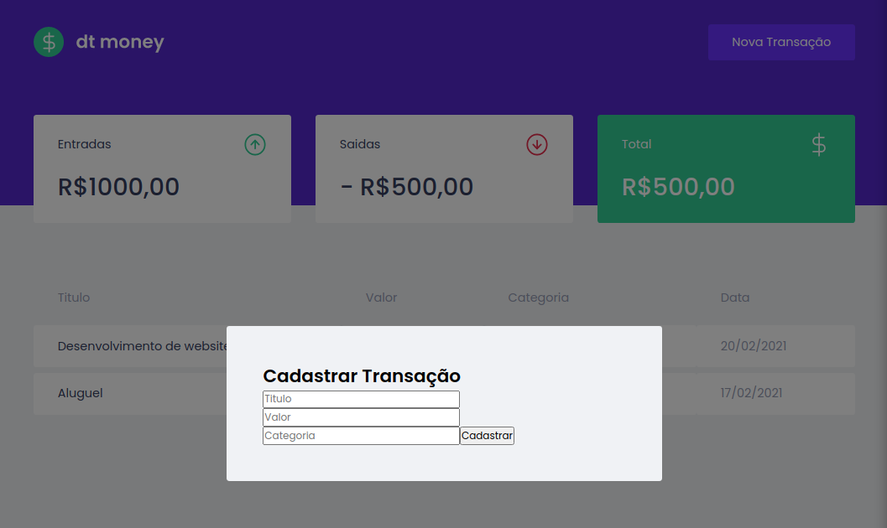
</h1>

  
### 4.4 Estilizando modal

src/components/NewTransactionModal/
Dentro do `styles.ts`.

<h1 align="center">
    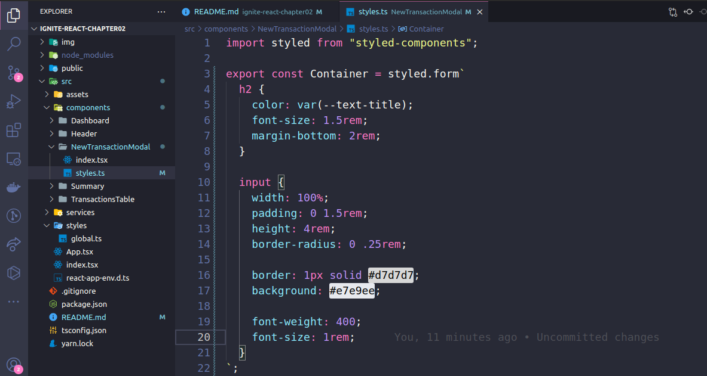
</h1>

Já temos o seguinte resultado do input:

<h1 align="center">
    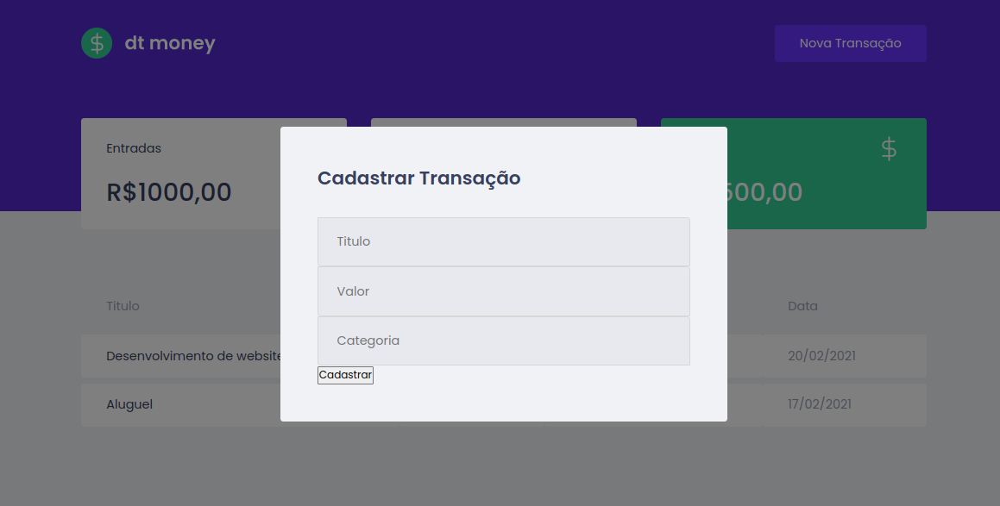
</h1>

Agora vamos trocar a cor de fundo do placeholder:

```
&::placeholder {
    color: var(--text-body);
}
```

E todo input que tiver antes um um input antes dele vai receber um espaço:

```
& + input {
      margin-top: 1rem;
}
```

<h1 align="center">
    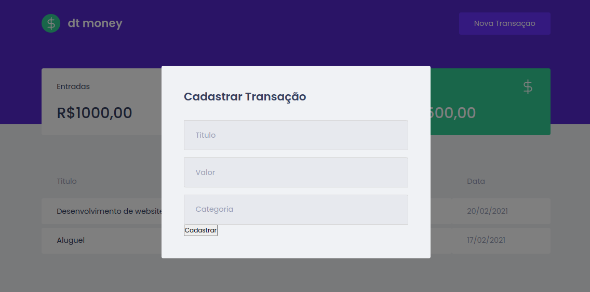
</h1>

E estilizar o button:

```
button[type="submit"] {
      width: 100%;
      padding: 0 1.5rem;
      height: 4rem;
      background: var(--green);
      color: #FFF;
      border-radius: 0.25rem;
      border: 0;
      font-size: 1rem;
      margin-top: 1.5rem;
      font-weight: 600;

      transition: filter 0.2s;

      &:hover {
        filter: brightness(0.9);
      }
    }
```

O transition, tem a finalidade de aminizar a mudança da cor:

```
transition: filter 0.2s;
```

Para que server o hover: Quando se passar o mouse por cima do botão ele ira diminuir a luminosidade.

```
&:hover {
        filter: brightness(0.9);
      }
```

<h1 align="center">
    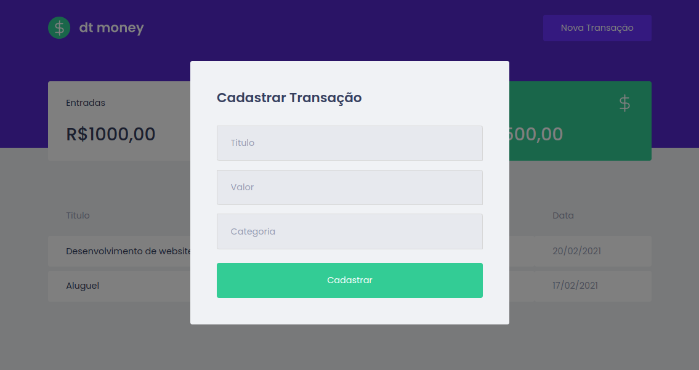
</h1>

E para deixa o Modal praticamente pronto vamos deixa o botão de fechar o modal pronto.
E vamos usar um uma imagem dentro do `assets` chamada `close.svg`.
Agora vamos importa dentro aquivo `index.tsx` essa imagem.

```
import closeImg from '../../assets/close.svg';
```

E vamos colocar ele dentro do Modal, antes do `<Container>`:

E quando o usuario usar `onClick` dele vai se execulta função `onRequestClose` que e função para fechar o modal. E adicionar uma classe para ficar um pouco mais facil

```
<button type="button" onClick={onRequestClose} className="react-modal-close">
    
</button>
```

Agora dentro de `styles` e `global.ts`.
E fazer a stilização do `react-modal-close`

```
.react-modal-close {
    position: absolute;
    right: 1.5rem;
    top: 1.5rem;
    border: 0;
    background: transparent;

    transition: filter 0.2s;

    &:hover {
      filter: brightness(0.8);
    }
  }
```

<h1 align="center">
    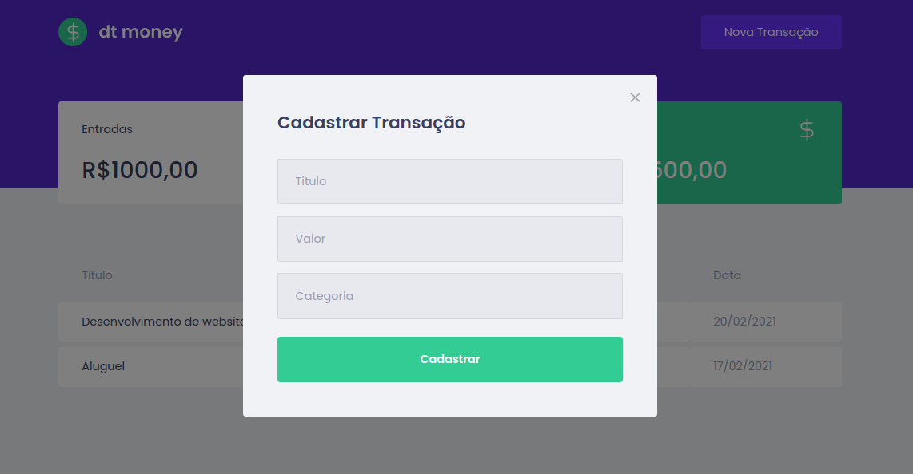
<<<<<<< HEAD
</h1>
=======
</h1>


### 4.5 Criando Botôes de Tipo.

Criação do botão de entrada e saída.
Dentro da pasta `NewTransactionModal` no arquivo `index.tsx` vamos criar entre o Valor e Categoria, criando um novo Container por volta desses dois intes entrada e saída com o nome `<TransactionTypeContainer>`

Vamos importa ele em styles:

`import { Container, TransactionTypeContainer } from './styles';`

Vamos importa a imagem:

```
import incomeImg from '../../assets/income.svg';
import outcomeImg from '../../assets/outcome.svg';
```

Sendo que ele vai ter uma imagem e um titulo

```
<TransactionTypeContainer>
    <button
        type="button"
    >
        
        <span>Entrada</span>
    </button>

    <button
        type="button"
    >
        
        <span>Saída</span>
    </button>
</TransactionTypeContainer>
```

e nos `styles.ts` exporta em baixo:

```
export const TransactionTypeContainer = styled.div`
    margin: 1rem 0;
  display: grid;
  grid-template-columns: 1fr 1fr;
  gap: 0.5rem;

  button {
    height: 4rem;
    border: 1px solid #d7d7d7;
    border-radius: 0.25rem;

    background: transparent;

    display: flex;
    align-items: center;
    justify-content: center;

    transition: border-color 0.2s;

    &:hover {
        border-color: #aaa;
    }

    img {
      width: 20px;
      height: 20px;
    }

    span {
      display: inline-block;
      margin-left: 1rem;
      font-size: 1rem;
      color: var(--text-title);
    }
  }
`;
```

Com relação ao hover, pode ser dado outra estilização, instalando um pacote `polished`.

`yarn add polished`.

importando:

`import { darken } from 'polished';`

E agora dentro do `&:hover` podemos mudar o `border-color: #aaa;`.

`border-color: ${darken(0.1, '#d7d7d7')};`

<h1 align="center">
    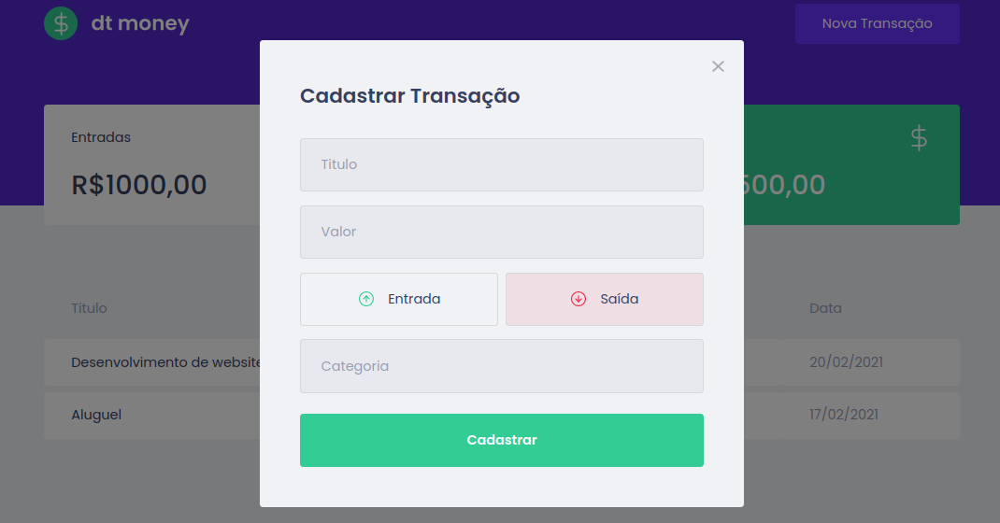
</h1>
>>>>>>> develop
